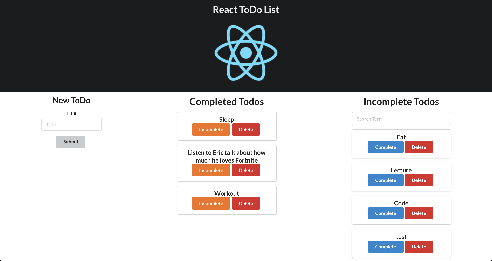

This project was bootstrapped with [Create React App](https://github.com/facebook/create-react-app).

# React ToDo List

## Setup

Run `npm install`

To get you going, we've got a backend with todos! To get these, you're going to have to do the following:

1. Run `json-server --watch db.json`
2. Visit `http://localhost:3000/todos` to confirm the list of todos.

If the command, `json-server` is not recognized, you might have to run `npm install -g json-server`

Let's run the app with `npm run start` or `npm start`. You will be asked if to use localhost:3001, consent to that.

## Background

We have a React To Do List. We want the App to manage which ones are Completed and which ones are Incomplete (too lazy to keep track).
We will be fetching the list of To Dos from the json server and render each one onto the page while organizing which ones go in the appropriate category. At the same time, we want to be able to add and remove todos from the list.

Ultimately, we want our App to look something like:



## Deliverables

**It might help to first draw out the component hierarchy**

<!-- * Fetch the data from http://localhost:3000/todos -->
<!-- * Render the each todo in the appropriate component -->
<!-- * Each todo card will have button to change the complete status which will conditionally render based on the location of component.  (Also, if a todo is under the Complete, the button text should say Incomplete and vice-versa.) -->
* When the button is clicked, the todo should be rendered in the appropriate component. BONUS: a PATCH request should be sent to http://localhost:3000/todos/:id to change the status of `completed` for the associated todo.
Don't forget:
```
    method: "PATCH",
    headers: {
        "Content-Type": "application/json",
        "Accept": "application/json"
    },
    body: JSON.stringify({})
```

Here is a gif of what it's supposed to look (Ignore the skull. That's a theme of my browser):


<!-- * Add a new todo to the collection and have it rendered. BONUS: Make a POST request to http://localhost:3000/todos.  -->
Don't forget: 
```
    method: "POST",
    headers: {
        "Content-Type": "application/json",
        "Accept": "application/json"
    },
    body: JSON.stringify({})
```
* Delete a todo from the collection. BONUS: Make a DELETE request to http://localhost:3000/todos/:id
Don't forget:
```
    method: "DELETE"
```

Here is a gif of what it's supposed to look:


* Incorporate the SearchBarComponent within the Incomplete Component to filter out todos. As you type, the Incomplete todos are dynamically rendered. 

Here is a gif of what it's supposed to look:


### Super Bonus

* Notice the Complete and Incomplete Components are a bit redundant. Is there anyway to reuse just one component for both of them?

### Unnecessary Bonus but Good Practice Bonus

* Let's say we wanted to sort out all the todos by longest title on top. Generate a button that handles that event. If the button is clicked again, the todos should be listed in their original order in the database. It is entirely up to you where to place the methods and buttons.

Here is how the button should look like (just for style):

(This button should appear if it's not sorted)
```
<button className="ui button green">Sort by Title Length</button>
```
(This button should appear if it's sorted)
```
<button className="ui button purple">Sort Title Normally</button>
```